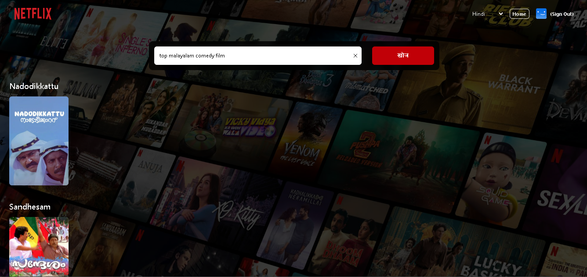

# AI-Integrated OTT Platform

AI-Integrated OTT Platform is a Netflix-inspired movie streaming and recommendation application that combines real-time movie data with AI-powered search and recommendation experiences.

The platform allows users to explore trending movies, watch trailers, and receive personalized recommendations using natural language prompts.

---

# Features

- multi language support
- Dynamic movie functionality
- AI-powered movie recommendations
- Personalized suggestions using prompts
- Responsive Netflix-inspired UI

---

# AI Integrations

- OpenAI API integration
- Gemini API integration
- Prompt-based movie recommendation workflows
- Natural language movie search experience

---

# Technical Highlights

- Real-time TMDB API integration
- Dynamic content rendering
- Reusable React component architecture
- Firebase Authentication
- Responsive frontend design
- API-driven application workflows

---

# Tech Stack

## Frontend

- React.js
- context
- Tailwind CSS

## Authentication

- Firebase Authentication

## APIs & Services

- TMDB API
- OpenAI API
- Gemini API

---

# Screenshots

## ai Recommendation Page


---

## ai Recommendation result



---

# Installation

## Clone Repository

```bash
git clone https://github.com/jomi087/ott_ai_platform.git
```

---

## Install Dependencies

```bash
npm install
```

---

## Start Development Server

```bash
npm run dev
```

---

# Environment Variables

Create a `.env` file in the root directory.

```env
VITE_FIREBASE_API_KEY=
VITE_FIREBASE_AUTH_DOMAIN=
VITE_FIREBASE_PROJECT_ID=
VITE_FIREBASE_STORAGE_BUCKET=
VITE_FIREBASE_MESSAGING_SENDER_ID=
VITE_FIREBASE_APP_ID=
VITE_FIREBASE_MEASUREMENT_ID=

VITE_TMDB_API_KEY=
VITE_TMDB_API_Read_Access_Token=

VITE_AI_PROVIDER= openai / genai

VITE_OPENAI_API_KEY=
VITE_GENAI_API_KEY=
```

---

# Learning Outcomes

This project helped improve knowledge in:

- Implimentation
  - vite + tailwind css
  - implimented routes useContext , useState , useEffect , useRef , constant variables ,
  - SignIn,SignUp form & its validation
  - Stored data in fireBase FireStore-Database
  - **Authentication with Firebase**
  - inbuilt env
  - implimented context api for athenticating routes
  - signOut
  - create a browse page with dynamic data from **TMDB**
  - createda search page and intigrated 3 languages in search bar
  - **Intigrated Gpt in search bar**

- Used fireBase fetures like
  - **createUserWithEmailAndPassword**,signInWithEmailAndPassword for authentication
  - **onAuthStateChanged** an event listner for listneting on the basis of sign-up,in,out
  - **updateProfile** for updating profile Here for the name ,
  - **db** for storing in db

- Tips
  - for "Forms" there is a library called **formik** which makes impliment "Form" easy like it help in validation error handling etc (jst check their website formik)

- **Firebase**
  - Firebase is a **backend platform by Google that helps developers build web and mobile apps without managing servers**,
    > simple way, its a platform for Backend as a service
        - It provides many ready-to-use features like:
            - Database – Store and sync data in real time (Firestore, Realtime Database).
            - Authentication – Allow users to log in using email, Google, Facebook, etc.
            - Storage – Save and retrieve files like images and videos.
            - Hosting – Deploy websites quickly with free SSL.
            - Functions – Run backend code without managing a server.
            - Analytics & Messaging – Track users and send notifications.
            - ETC.....................

- **InBuilt DotEnv and its Rule**
  - Vite has built-in support for environment variables. You can use .env files directly.
    - That means , no need to import or install any env cz Vite automatically loads .env files but it should be create in root of our project
  - As a Rule for securty purpose use VITE first
    - Vite only exposes environment variables to the frontend if they start with VITE*. Any variable without VITE* will not be available in import.meta.env.This is done for security reasons—so that by default, sensitive backend variables (like database passwords) don’t get exposed accidentally.So, if you want to use an environment variable in a Vite React app, you must prefix it with VITE\_.
  - In Vite, environment variables are accessed using
    > import.meta.env
    - instead of process.env.keyname

---

---

# Author
jomi